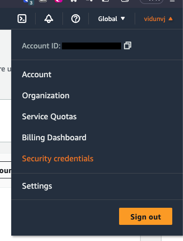
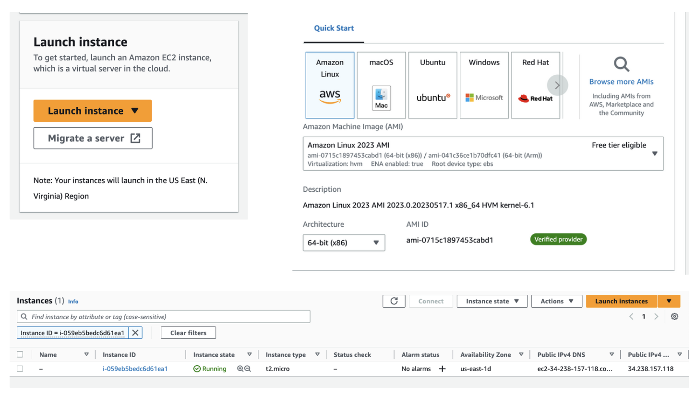
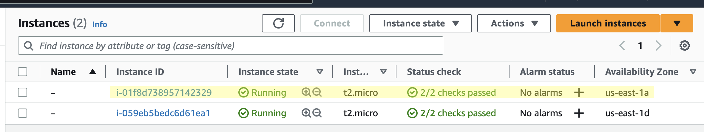
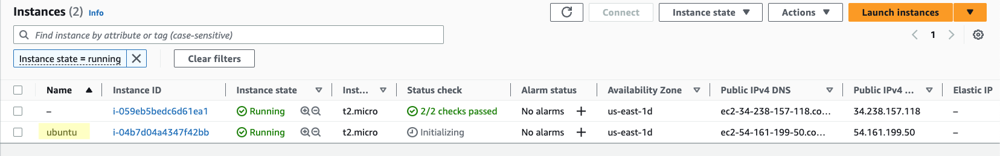

# Terraform Fundamentals

This repository is for my notes on Terraform basics following [freecodecamp.org](https://www.youtube.com/watch?v=SLB_c_ayRMo) on YouTube.

The first step to any terraform deployment is to specify which cloud provider you will be using. For our example, we will use AWS and so the syntax will look like this:

```json
provider "aws" {
    region = "us-east-1"
    access_key = "xxxxxxxxxxxxxxxxxxx"
    secret_key = "xxxxxxxxxxxxxxxxxxxxxxxxxxxxxxxxxxxxxx"
}
```

The `access_key` and `secret_key` will be taken from the security credentials page of the AWS console.



Resources in Terraform are all deployed using the same syntax:

```json
resource "<provder>_<resource_type>" "name" {
	config options...
	key = "value"
	key2 = "value2"
}
```

For our example, we’ll look at how to deploy an EC2 instance using Terraform; Traditionally, you can deploy an EC2 instance using the AWS console like so:



Now let’s take a look at how to do this using Terraform.

```json
resource "aws_instance" "my-first-server" {
    ami = "ami-053b0d53c279acc90"
    instance_type = "t2.micro"
}
```

**Note** that the server name ("`my-first-server`") is Terraform-scoped and will not be visible to AWS. AMI is an **Amazon Machine Image** and just specifies what image to use for the EC2 instance. In this example, I used a Ubuntu Server 22.04 LTS image and the `t2.micro` instance type since it’s available in the free tier of AWS.

Now we have a basic deployment. To run it, navigate into the project directory and run:

```bash
$ terraform init

Initializing the backend...

Initializing provider plugins...
- Finding latest version of hashicorp/aws...
- Installing hashicorp/aws v5.1.0...
- Installed hashicorp/aws v5.1.0 (signed by HashiCorp)

Terraform has created a lock file .terraform.lock.hcl to record the provider
selections it made above. Include this file in your version control repository
so that Terraform can guarantee to make the same selections by default when
you run "terraform init" in the future.

Terraform has been successfully initialized!

You may now begin working with Terraform. Try running "terraform plan" to see
any changes that are required for your infrastructure. All Terraform commands
should now work.

If you ever set or change modules or backend configuration for Terraform,
rerun this command to reinitialize your working directory. If you forget, other
commands will detect it and remind you to do so if necessary.
```

This will initialize the project and download any necessary plugins (like the AWS api). Next, run AWS plan to map out what changes are going to be made:

```bash
$ terraform plan

Terraform used the selected providers to generate the following
execution plan. Resource actions are indicated with the following
symbols:
  + create

Terraform will perform the following actions:

  # aws_instance.my-first-server will be created
  + resource "aws_instance" "my-first-server" {
      + ami                                  = "ami-053b0d53c279acc90"
      + arn                                  = (known after apply)
      + associate_public_ip_address          = (known after apply)
      + availability_zone                    = (known after apply)
      + cpu_core_count                       = (known after apply)
      + cpu_threads_per_core                 = (known after apply)
      + disable_api_stop                     = (known after apply)
      + disable_api_termination              = (known after apply)
      + ebs_optimized                        = (known after apply)
      + get_password_data                    = false
      + host_id                              = (known after apply)
      + host_resource_group_arn              = (known after apply)
      + iam_instance_profile                 = (known after apply)
      + id                                   = (known after apply)
      + instance_initiated_shutdown_behavior = (known after apply)
      + instance_state                       = (known after apply)
      + instance_type                        = "t2.micro"
      + ipv6_address_count                   = (known after apply)
      + ipv6_addresses                       = (known after apply)
      + key_name                             = (known after apply)
      + monitoring                           = (known after apply)
      + outpost_arn                          = (known after apply)
      + password_data                        = (known after apply)
      + placement_group                      = (known after apply)
      + placement_partition_number           = (known after apply)
      + primary_network_interface_id         = (known after apply)
      + private_dns                          = (known after apply)
      + private_ip                           = (known after apply)
      + public_dns                           = (known after apply)
      + public_ip                            = (known after apply)
      + secondary_private_ips                = (known after apply)
      + security_groups                      = (known after apply)
      + source_dest_check                    = true
      + subnet_id                            = (known after apply)
      + tags_all                             = (known after apply)
      + tenancy                              = (known after apply)
      + user_data                            = (known after apply)
      + user_data_base64                     = (known after apply)
      + user_data_replace_on_change          = false
      + vpc_security_group_ids               = (known after apply)
    }

Plan: 1 to add, 0 to change, 0 to destroy.

─────────────────────────────────────────────────────────────────

Note: You didn't use the -out option to save this plan, so
Terraform can't guarantee to take exactly these actions if you
run "terraform apply" now.
```

Finally, we can run `terraform apply` to run the code:

```bash
$ terraform apply

Terraform used the selected providers to generate the following execution plan. Resource actions are
indicated with the following symbols:
  + create

Terraform will perform the following actions:

  # aws_instance.my-first-server will be created
  + resource "aws_instance" "my-first-server" {
      + ami                                  = "ami-053b0d53c279acc90"
      + arn                                  = (known after apply)
      + associate_public_ip_address          = (known after apply)
      + availability_zone                    = (known after apply)
      + cpu_core_count                       = (known after apply)
      + cpu_threads_per_core                 = (known after apply)
      + disable_api_stop                     = (known after apply)
      + disable_api_termination              = (known after apply)
      + ebs_optimized                        = (known after apply)
      + get_password_data                    = false
      + host_id                              = (known after apply)
      + host_resource_group_arn              = (known after apply)
      + iam_instance_profile                 = (known after apply)
      + id                                   = (known after apply)
      + instance_initiated_shutdown_behavior = (known after apply)
      + instance_state                       = (known after apply)
      + instance_type                        = "t2.micro"
      + ipv6_address_count                   = (known after apply)
      + ipv6_addresses                       = (known after apply)
      + key_name                             = (known after apply)
      + monitoring                           = (known after apply)
      + outpost_arn                          = (known after apply)
      + password_data                        = (known after apply)
      + placement_group                      = (known after apply)
      + placement_partition_number           = (known after apply)
      + primary_network_interface_id         = (known after apply)
      + private_dns                          = (known after apply)
      + private_ip                           = (known after apply)
      + public_dns                           = (known after apply)
      + public_ip                            = (known after apply)
      + secondary_private_ips                = (known after apply)
      + security_groups                      = (known after apply)
      + source_dest_check                    = true
      + subnet_id                            = (known after apply)
      + tags_all                             = (known after apply)
      + tenancy                              = (known after apply)
      + user_data                            = (known after apply)
      + user_data_base64                     = (known after apply)
      + user_data_replace_on_change          = false
      + vpc_security_group_ids               = (known after apply)
    }

Plan: 1 to add, 0 to change, 0 to destroy.

Do you want to perform these actions?
  Terraform will perform the actions described above.
  Only 'yes' will be accepted to approve.

  Enter a value: yes

aws_instance.my-first-server: Creating...
aws_instance.my-first-server: Still creating... [10s elapsed]
aws_instance.my-first-server: Still creating... [20s elapsed]
aws_instance.my-first-server: Still creating... [30s elapsed]
aws_instance.my-first-server: Still creating... [40s elapsed]
aws_instance.my-first-server: Creation complete after 43s [id=i-01f8d738957142329]

Apply complete! Resources: 1 added, 0 changed, 0 destroyed.
```

Now we can see the EC2 instance deployed in our AWS Console:



Note that running `terraform apply` a second time would not create another new instance. What we write in this file is what our infrastructure should look like, not a set of steps to carry out.

Now, we can update our terraform configuration by, let’s say adding some tags:

```json
resource "aws_instance" "my-first-server" {
    ami = "ami-053b0d53c279acc90"
    instance_type = "t2.micro"
		tags = {
			Name = "ubuntu"
		}
}
```

Now we run `terraform plan`. Notice that there are yellow `~` marks that tell us we are modifying something (not adding or removing).

```bash
$ terraform plan
aws_instance.my-first-server: Refreshing state... [id=i-04b7d04a4347f42bb]

Terraform used the selected providers to generate the following execution plan. Resource actions are
indicated with the following symbols:
  ~ update in-place

Terraform will perform the following actions:

  # aws_instance.my-first-server will be updated in-place
  ~ resource "aws_instance" "my-first-server" {
        id                                   = "i-04b7d04a4347f42bb"
      ~ tags                                 = {
          + "Name" = "ubuntu"
        }
      ~ tags_all                             = {
          + "Name" = "ubuntu"
        }
        # (30 unchanged attributes hidden)

        # (8 unchanged blocks hidden)
    }

Plan: 0 to add, 1 to change, 0 to destroy.

────────────────────────────────────────────────────────────────────────────────────────────────────────

Note: You didn't use the -out option to save this plan, so Terraform can't guarantee to take exactly
these actions if you run "terraform apply" now.
```

Then, we run `terraform apply`.



Now we can see that the instance has been updated with the name tag we added in the Terraform file.

## Terraform Files
- `terraform` - This folder gets created when we run `terraform init` and contains all the necessary plugins for our code to run. This is where all the code for the provider (AWS in our case) gets stored
- `terraform.tfstate` - This file represents all of the state for terraform. Anytime we create a resource for AWS or any other provider, it needs to be able to track what changes have been mode so it doesn’t do the same thing twice, for example.

## Securely Storing Access/Secret Keys
The problem with the code so far is that the access key and secret key are hard coded, which poses an obvious security risk. To mitigate this, we use profiles; but we must first set up our AWS account on our AWS cli. To do this, run `aws configure`:

```bash
$ aws configure
AWS Access Key ID [None]: xxxxxxxxxxxxxxxxxxx
AWS Secret Access Key [None]: xxxxxxxxxxxxxxxxxxxxxxxxxxxxxxxxxxxxxx
Default region name [None]: us-east-1
Default output format [None]: json
```

This will create the `~/.aws` folder. In which you will find the `config` and `credentials` files:

```text
[default]
region = us-east-1
output = json
```

```text
[default]
aws_access_key_id = xxxxxxxxxxxxxxxxxxx
aws_secret_access_key = xxxxxxxxxxxxxxxxxxxxxxxxxxxxxxxxxxxxxx
```

Now, you can update the Terraform code to use the `default` profile instead of exposing secret keys:

```json
provider "aws" {
    region = "us-east-1"
    # aws access key and secret key taken from .aws
    profile = "default"
}
```